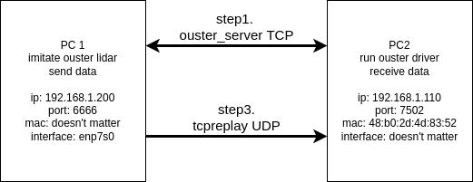

# Introduction

This is a pcap replay for ouster lidar.

# Requiremetns

* Jsoncpp
* ouster lidar hardware
* tcpreplay
* python3

```bash
sudo apt install -yq tcpreplay libjsoncpp-dev
```

# Usage

### Data Recording

1. use `wireshark` to record pcap files of ouster lidar
2. save the `metadata.json` file for configuration


### Configs



```yaml
# the following network configs need be modified by another computer which runs the ouster driver and receive udp data
# the settings could be getten by the command `ifconfig`
network:
  interface: "enp7s0"  # the network interface you use to send data

  dest_mac: "48:b0:2d:4d:83:52" # the destination mac address to receive data

  new_dest_ip: "192.168.1.110" # the destination ip address to receive data

ouster_config: "./config/extra_ouster.json" # will be updated automaticlly by the ouster driver

# the following configs need be modified by a specific pcap file
pcap_file:
    path: "/home/yinwu/Workspace/test/processed.pcap"
    
    old_dest_ip: "192.168.1.110" # the original destination ip address in the pcap file

    old_dest_port: 7502 # the original destination port in the pcap file
```

### Compile

```bash
bash build_all.sh
```

### Replay

1. replace the [ouster.json](./config/ouster.json) with your own metadata.json, and rename it to "ouster.json"
2. modify the [tcpreplay.yaml](./config/tcpreplay.yaml)


```bash
# 1. start firstly the ouster_server, which imitate the real ouster server in a lidar hardware
bash run_ouster_server.sh

# 2. start the ouster driver in another computer to receive the udp ouster data

# 3. replay the pcap file
bash run_tcpreplay.sh
```